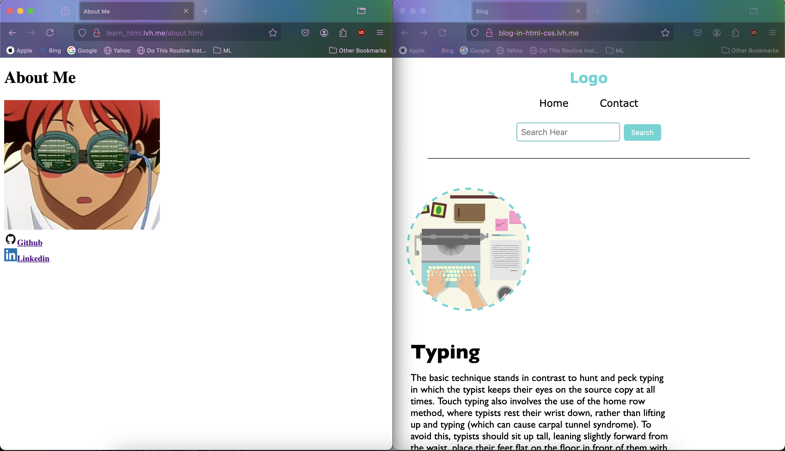

# NGINX Git Repository Hosting

This project sets up a Dockerized NGINX server that hosts static websites by cloning repositories from a specified Git URL. It simplifies the process of deploying static HTML, CSS, and JavaScript files directly from a Git repository. 

## Features

- **Automated Repository Cloning**: Provides a script to clone a repository from a given URL.
- **Custom NGINX Configuration**: Uses a custom `nginx.conf` for serving files based on subdomains.
- **Containerized Setup**: Uses Docker to containerize the NGINX server with the cloned repository.

## Setup

### Prerequisites

- [Docker](https://docs.docker.com/get-docker/) installed on your machine.

### Usage

1. **Build Docker Image**:
 
   ```bash
   docker build --build-arg REPO_URL <repo-url> -t <image-title> .
2. **Run Docker Container**
    ``` bash
    docker run -d -p 80:80 <container-id>
      ```
3. **Access your Hosted Site**
- The website will be available at http://lvh.me or http://<strong>\<subdomain></strong>.lvh.me
- Replace <subdomain> with the name of your Git repository to access different sites.

## Example
<div align="center">
    
    <p><em>Two different hosted repos</em></p>
</div>
